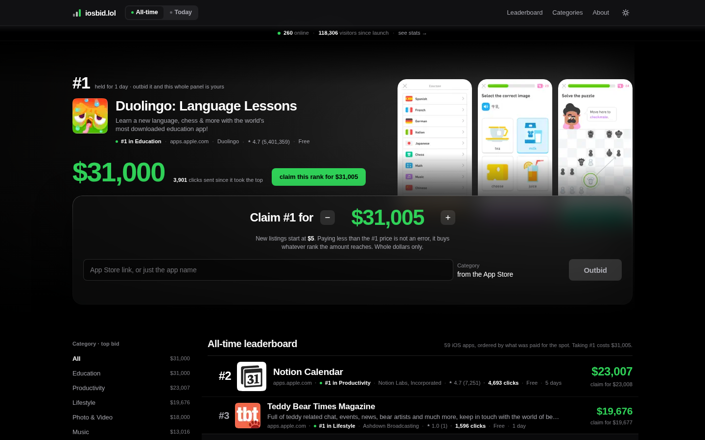
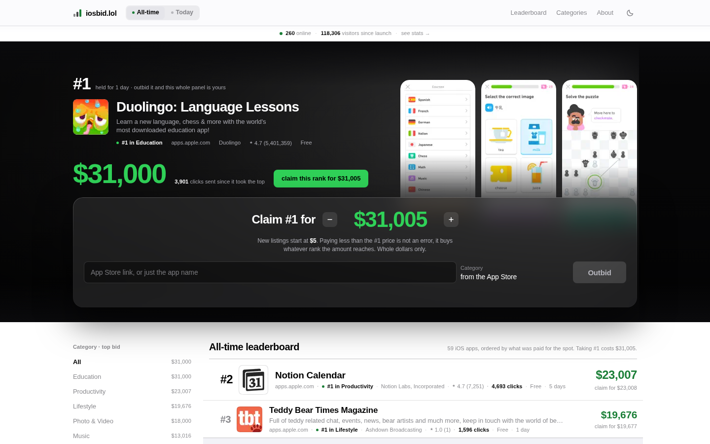
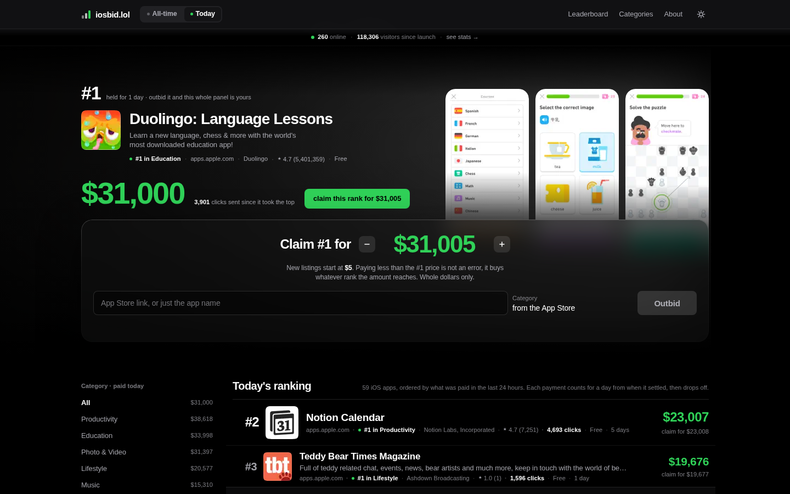
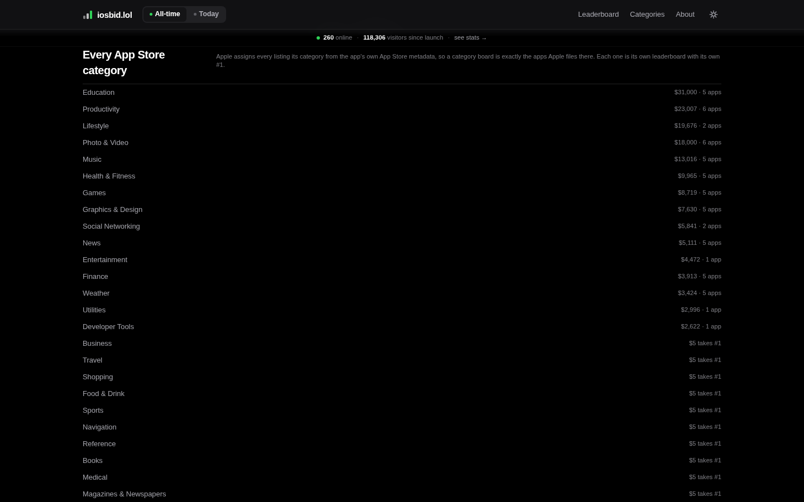
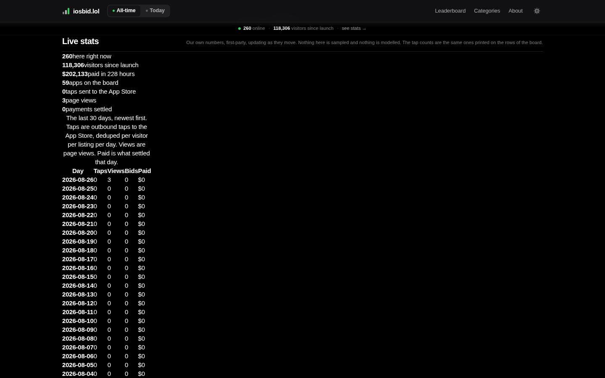
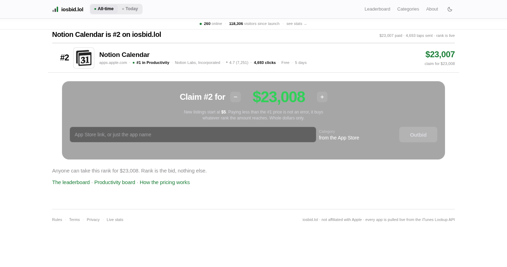
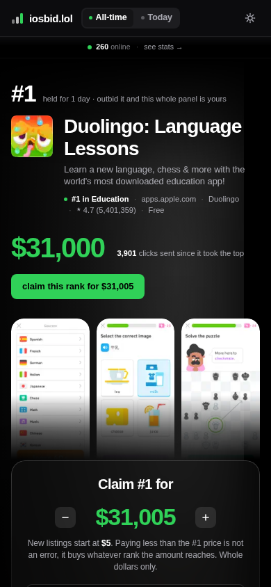
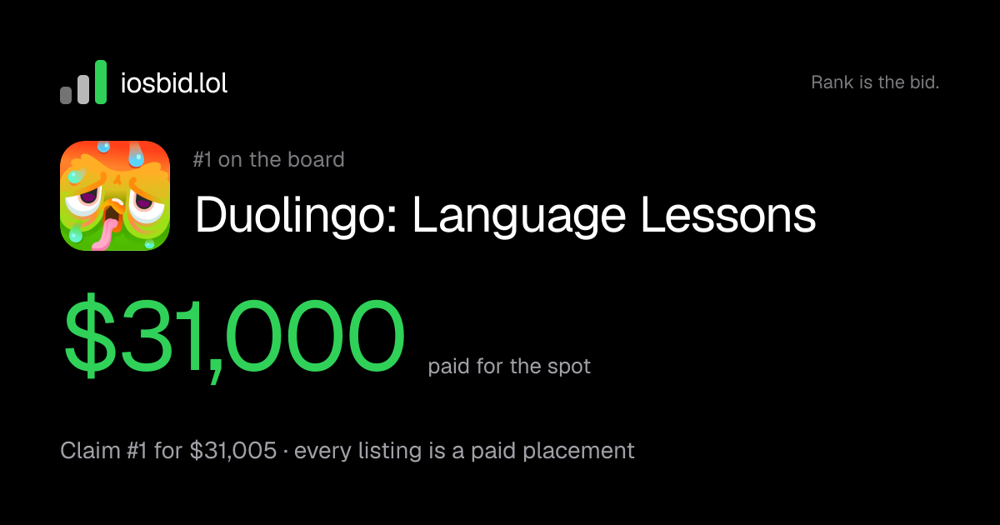

# iosbid.lol

A public leaderboard for iOS App Store apps where rank is the bid and nothing else.

Every listing is a real app pulled live from Apple's iTunes Lookup API, so there is no submission
form, no editorial process and no fake rows. Pay more than the app above you and you move above it.

> Screenshots below run against seeded development data. Every number in them is
> randomly generated, including the bids, the tap counts and the visitor totals.
> See [seeding](#seeding) to reproduce them.



## The rules

Whole US dollars only.

| | |
|---|---|
| New listing | $5 minimum, $999,999 maximum |
| Taking #1 | at least the top bid plus $5 |
| Taking any other rank | at least that rank's bid plus $1 |
| Paying less than #1 | not an error, it buys whatever rank the amount reaches |
| Equal bids | the older bid holds the higher rank |
| Raising your own app | charged the difference only, minimum $1 |

Every row shows what it costs to take that exact position, so the board reads as a price list of
ranks. Activating it prefills the bid form with that number.

The Today board ranks the last 24 hours of settled payments. A payment counts for a day from when it
cleared, then drops off, while still counting toward the app's all-time total.

## It updates itself

A settled payment pushes new ranks to every open board over a WebSocket. No polling, no refresh
button, no stale positions. Boards are still server-rendered first, so a crawler receives the
complete board rather than a loading state, and the browser then resumes that same subscription with
no refetch.

## Light and dark

True black, and Apple's system light palette rather than an inversion. The theme resolves before
first paint, so there is no flash of the wrong one.



## Other surfaces

| | |
|---|---|
|  |  |
| **Today**, a rolling 24 hour window | **Categories**, every App Store genre with its own board |
|  |  |
| **Stats**, published live | **Receipt**, what a buyer posts after paying |



Every page has a generated share card:



## Stack

- **TanStack Start** on Vercel. Server-rendered React, file-based routing.
- **Convex** as backend and database. Queries, mutations, Node actions, crons, and the Stripe
  webhook as an HTTP action. Reactivity comes from here.
- **Stripe Checkout** for payment. Anonymous, no accounts, settled in the webhook.
- **datafa.st** for visitor analytics, with a public dashboard.

There is no authentication anywhere, and no per-listing detail page. `/r/:slug` is a receipt, a
share target for someone who paid, and nothing on the board links to it.

## Running it

```bash
pnpm install
npx convex dev --once     # provisions a deployment and writes .env.local
pnpm dev
```

Payments need two secrets on the Convex deployment, not in `.env.local`:

```bash
npx convex env set SITE_ORIGIN          http://localhost:3000
npx convex env set STRIPE_SECRET_KEY    sk_test_...
npx convex env set STRIPE_WEBHOOK_SECRET whsec_...   # from the command below
pnpm stripe:listen
```

Checkout fails closed if any of those is missing: it logs the variable name and returns a generic
message to the buyer, rather than charging against a half-configured deployment.

```bash
pnpm typecheck
pnpm test
pnpm build
./scripts/check-seo.sh http://localhost:3000
```

## Seeding

An empty board is hard to look at, so `convex/seed.ts` fills a development
deployment with plausible traffic: outbound taps that decay with rank, bid times
spread across the last nine days, presence rows and a visitor total.

```bash
npx convex run seed:traffic '{"confirm":"yes-seed-this-deployment"}'
npx convex run seed:clearTraffic '{"confirm":"yes-seed-this-deployment"}'
```

It writes nothing a real visitor could not have: taps land in the same sharded
counter `/go/:slug` uses, and the money ledger is never touched, so `totalBid`,
`boardStats` and `siteStat.revenue` stay whatever really settled. The
confirmation string is deliberate. It is an internal mutation, so it is not
reachable from the browser.

Listings themselves come from real bids. To put apps on the board, run a bid
through `bids:createPending` and `bids:settle`, or pay through Stripe test mode.

## Notes on the SEO surface

Outbound listing links are `rel="sponsored nofollow noopener"` and route through `/go/:slug` so taps
are counted. Paid placement does not pass PageRank, and selling it as though it does is a liability
for both sides. What a listing buys is referral traffic, and the public tap count on every row is the
proof of delivery.

`scripts/check-seo.sh` runs the assertions that matter against a deployed URL, counting with
`grep -o | wc -l` rather than `grep -c`, because server-rendered HTML is one long line and `grep -c`
would return 1 on a completely broken board.

## Not affiliated with Apple

App names, icons, screenshots, ratings and categories come from the Apple App Store. Listings are
paid placements, not reviews, endorsements or an editorial ranking.
